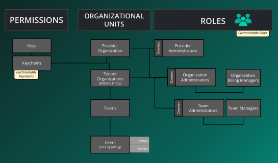

Organizations are the basic unit of multi-tenancy inside of Layer5 Cloud. The identity structure is highly flexible: organizations can have any number of teams, teams can have any number of users, and users can belong to any number of teams and organizations.

Below is an overview of the core identity components within the Layer5 Cloud.

## Identity

Organizations serve as the fundamental component of multi-tenancy within the Layer5 Cloud.

They act as the top-level parent entity. All users and teams ultimately roll up to an organization. While Free plan users are limited to a single default organization, enterprise environments can leverage organizations to strictly isolate resources, billing, and access control across entirely different business units.

Outside of grouping users together, teams offer controlled access to workspaces and to workspace resources such as environments and managed and unmanaged connections.

Administrators can create teams as child units below the top-level organization. This allows you to apply unique settings, permissions, and workspace access to a specific set of users without altering the parent organization's settings.

Each user account represents an individual collaborator. Individual user accounts exist beyond the bounds of organizations.

Anyone who uses Layer5 Cloud signs into a user account, which acts as your sovereign identity. Your user account can independently own resources such as workspaces, designs, connections, and tokens. Any action taken on the platform is directly attributed to your individual user account, regardless of which teams or organizations you belong to.

## Organizational Units

Layer5 Cloud uses a hierarchical structure to isolate resources and manage users at scale:

* **Provider Organizations:**  The top-level entity that can manage multiple tenant organizations.
* **Tenant Organizations:** Individual customer or project-specific organizations (e.g., Layer5, Intel).
* **Teams:** Logical groupings of users within an organization to facilitate collaborative management.
* **Users:** Individual accounts that are members of teams and organizations.

## Role and Access Control

Access is granted through Role-Based Access Control (RBAC). Roles are assigned at different levels of the organizational hierarchy:

* **Provider Administrators:** Management of provider-level settings and tenant organizations.
* **Organization Administrators:** Full control over an entire tenant organization.
* **Organization Billing Managers:** Access restricted to subscription and financial management.
* **Team Administrators:** Management of specific team resources and memberships.
* **Workspace Administrators:** Management of workspace-level resources and access.

## Key Management and Tokens

Beyond structural roles, Layer5 Cloud uses cryptographic and session-based security:

### Keychains

Keychains are collections of keys used to manage environment-specific access and signing. They allow for the logical grouping of related security credentials.

### Keys

Keys are the atomic unit of access control within the system. They are used for secure communication between Meshery and Layer5 Cloud, as well as for signing design patterns.

### Tokens

Tokens provide temporary, secure access to the platform.

* **Session Tokens:** Used for web browser authentication.
* **Personal Access Tokens (PATs):** Used for programmatic access via CLI or CI/CD pipelines.

### Need more detail?

Check out the [Roles Reference](/cloud/concepts/identity-and-access/roles/) for a complete matrix of permissions for each role.
